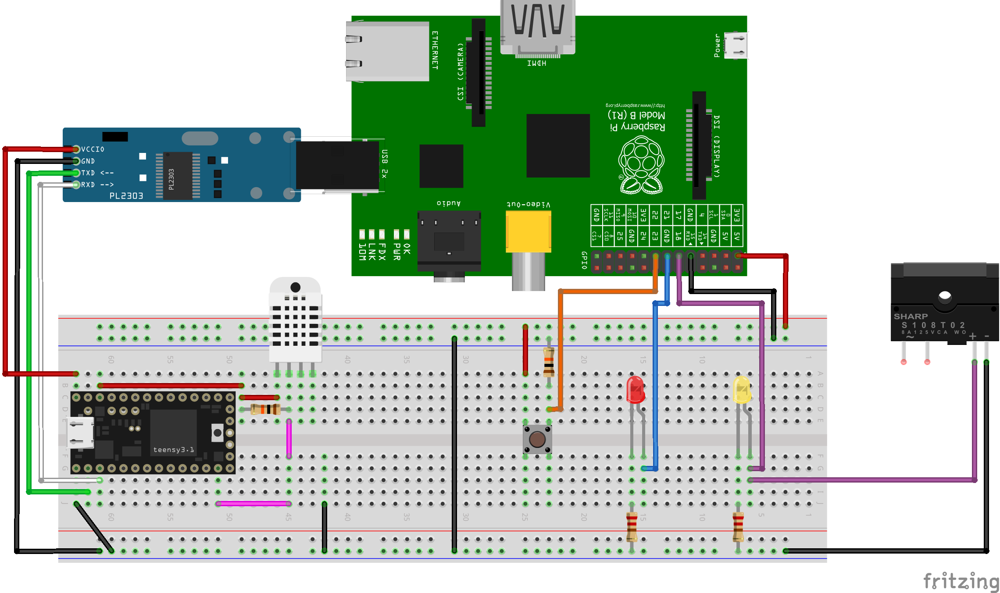

# Hardware aspects

This directory contains the code and hardware schematic portion of the demo. Temperature and humidity data is measured by the Teensy then transferred to the Raspberry Pi 3 (RPi3) via a USB Serial adapter. The RPi3 can control outputs via the LED or mains power via a relay. It can receive input via a button or can be controlled remotely via a network connection.

## Images


Schematic of the connected parts. Relay portion is not expanded for brevity.

## Teensy Arduino for temparature and humidity

This is the Arduino code that runs on the Teensy portion of the demo. The Teensy obtains the temperature and humidity data from the DHT22 and outputs them to both the USB-UART0 and the UART1 pins.

## Setting up your Arduino IDE

1. Download and install the latest version of the [Arduino IDE](https://www.arduino.cc/en/Main/Software).

2. Download and install [Teensyduino](https://www.pjrc.com/teensy/td_download.html)

3. Just open `arduino-temp-humidity.ino`.

4. Change Board type to Teensy 3.2 then upload the code into the board.

## Setting up Raspberry Pi 3

Ubuntu 16.04 is required to be installed on the Raspberry Pi 3 to use Swift. Raspbian cannot be used as certain dependencies are not available.

### Install Ubuntu on Raspberry Pi 3

To get Ubuntu installed on the Raspberry Pi, follow the instructions in this [link](https://wiki.ubuntu.com/ARM/RaspberryPi). 

### Network bug on Raspberry Pi 3 Ubuntu after system update

Reference from a [comment of this page link](http://dev.iachieved.it/iachievedit/building-swift-3-0-on-a-raspberry-pi-3/#comment-2072). The `eth0` ethernet adapter has been changed to something like `enxp...`.

```bash
#Get new name of network adapter
ifconfig -a
#enxp....
sudo nano /etc/network/interfaces.d/50-cloud-init.cfg
#Replace eth 0 with the name of your new adapter enxp...
sudo reboot
```

### Install Swift 3 on Ubuntu on Raspberry Pi 3
Instructions from this section is referenced from this [link](http://dev.iachieved.it/iachievedit/swift-3-0-on-raspberry-pi-2-and-3/).

Since Swift 3 is still rapidly evolving, we should not use the Swift packages provided via the apt package manager if they exist and instead use prebuilt binaries instead. We will also not install Swift 3 to the system-level directories to avoid problems in case we have to update the version.

Go to this [page](http://swift-arm.ddns.net/job/Swift-3.0-Pi3-ARM-Incremental/lastSuccessfulBuild/artifact/) and find what it is the link to the latest Swift compiled `tar.gz` package.

```bash
#Install dependencies
sudo apt-get install libcurl4-openssl-dev libicu-dev clang-3.6
sudo update-alternatives --install /usr/bin/clang clang /usr/bin/clang-3.6 100
sudo update-alternatives --install /usr/bin/clang++ clang++ /usr/bin/clang++-3.6 100

cd ~
#Replace the link below with the latest version
wget http://swift-arm.ddns.net/job/Swift-3.0-Pi3-ARM-Incremental/lastSuccessfulBuild/artifact/swift-3.0-2016-09-27-RPi23-ubuntu16.04.tar.gz
mkdir swift-3.0
cd swift-3.0 && tar -xzf ../swift-3.0-2016-09-27-RPi23-ubuntu16.04.tar.gz

#This command can be added to your bash profile so Swift will be in your PATH after a reboot
nano ~/.profile
export PATH=$HOME/swift-3.0/usr/bin:$PATH
```

### Compiling and running the code

```bash
git clone https://github.com/subhransu/iosconfsg-talk
cd iosconfsg-talk/hardware/rpi3-swift
swift build

#Run the program. Root permissions is required to access the GPIO.
sudo ./.build/debug/rpi3-swift
```
